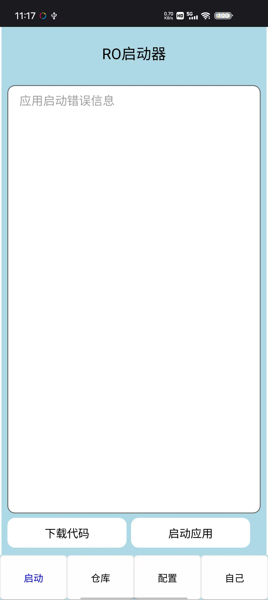
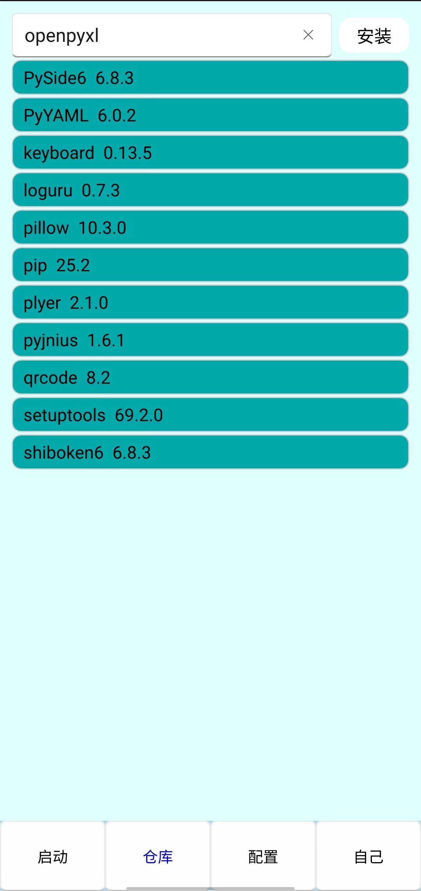
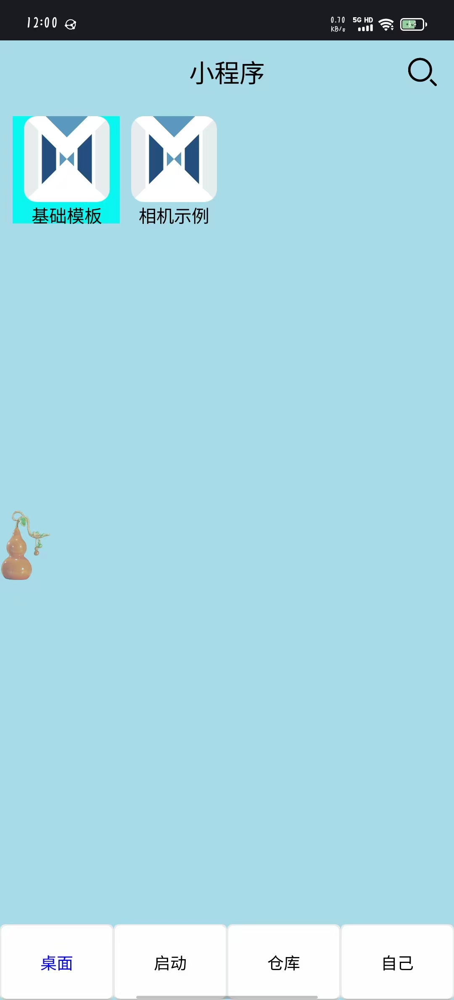
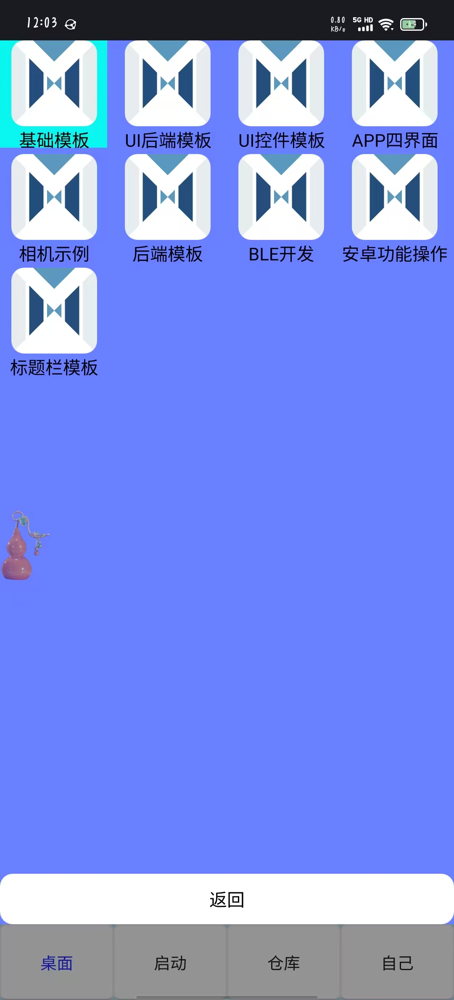

# RO启动器
一个支持在安卓手机上运行Python代码的APP。基于PySide6 + QML界面开发，可以运行多个PySide6小程序。

官网 [www.rostart.top](www.rostart.top)

    

# 下载链接
夸克网盘
[https://pan.quark.cn/s/4997433c27db](https://pan.quark.cn/s/4997433c27db)

# 小程序代码
MiniAPP目录下

# 版本更新
- 2.0.0 小程序版本发布
- 2.1.0 修改代码结构，更新程序时，不会把下载的小程序删除
- 2.2.0 支持通过搜索下载服务器上的代码
- 2.3.0 添加TTS模块
- 2.4.0 修改基础API为28，可支持运行文件。添加openai及依赖库。

# 交流群

  
