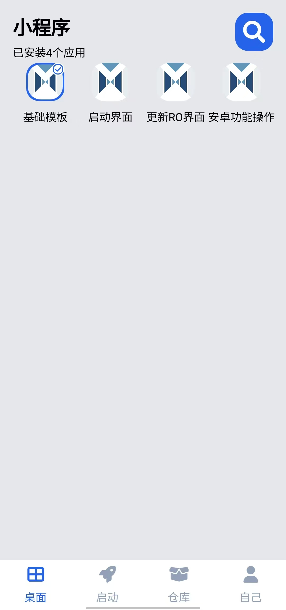
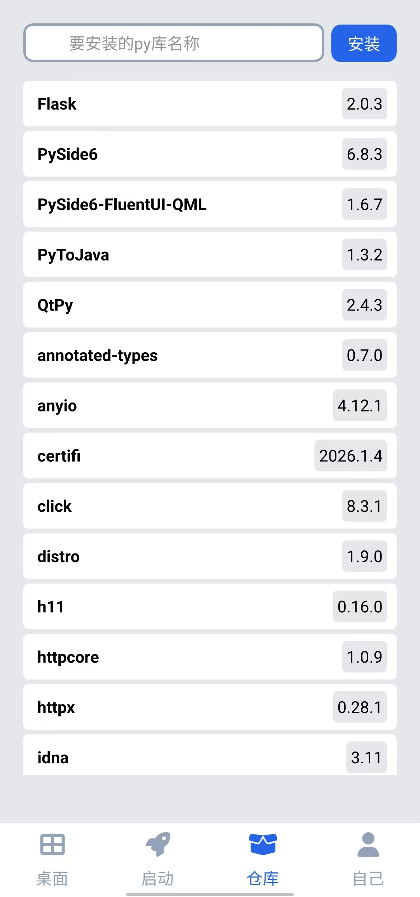
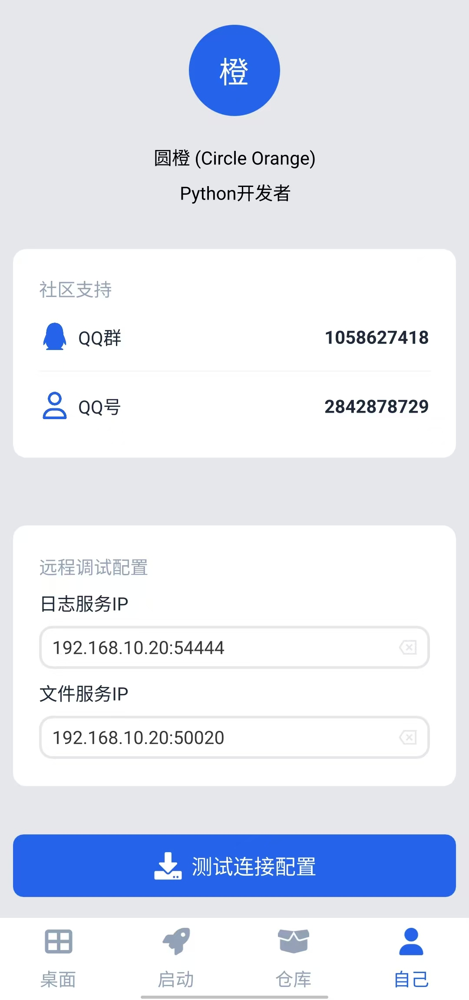
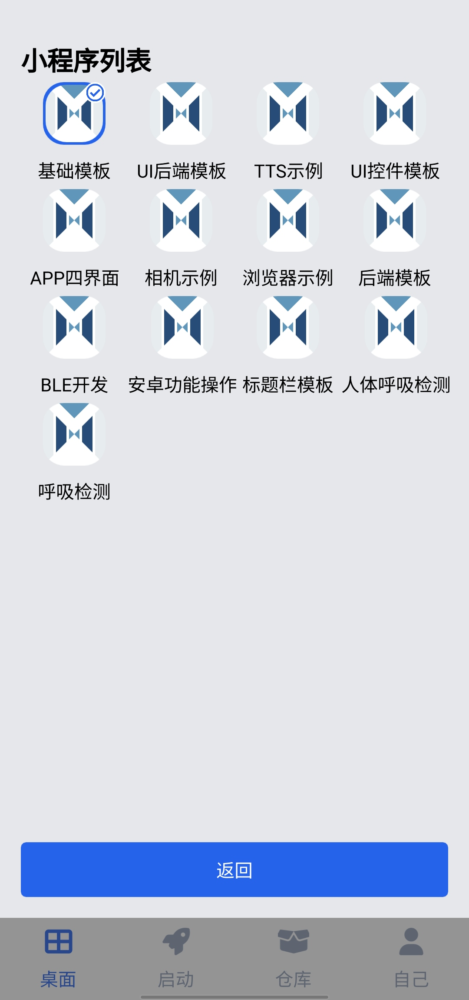

# RO启动器
一个支持在安卓手机上运行Python代码的APP。基于PySide6 + QML界面开发，可以运行多个PySide6小程序。

官网 [www.rostart.top](www.rostart.top)

     

# 下载链接
夸克网盘
[https://pan.quark.cn/s/4997433c27db](https://pan.quark.cn/s/4997433c27db)

# 小程序代码
MiniAPP目录下

# 版本更新
- 4.0 添加悬浮按钮，点击可以退出小程序

# 交流群

  
